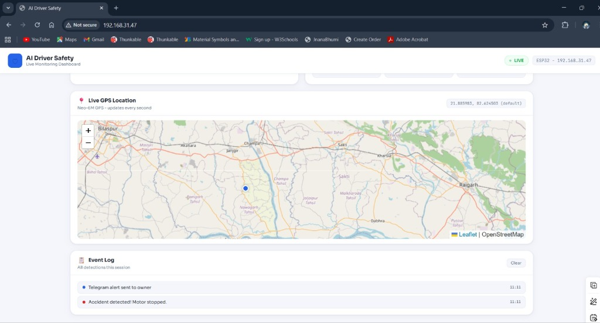
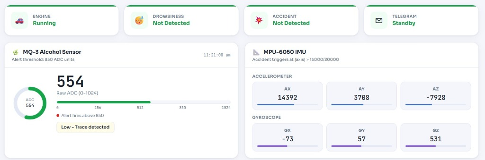
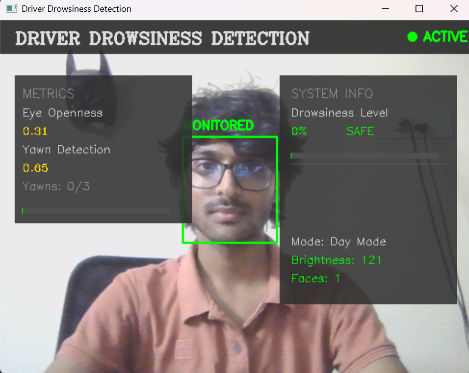
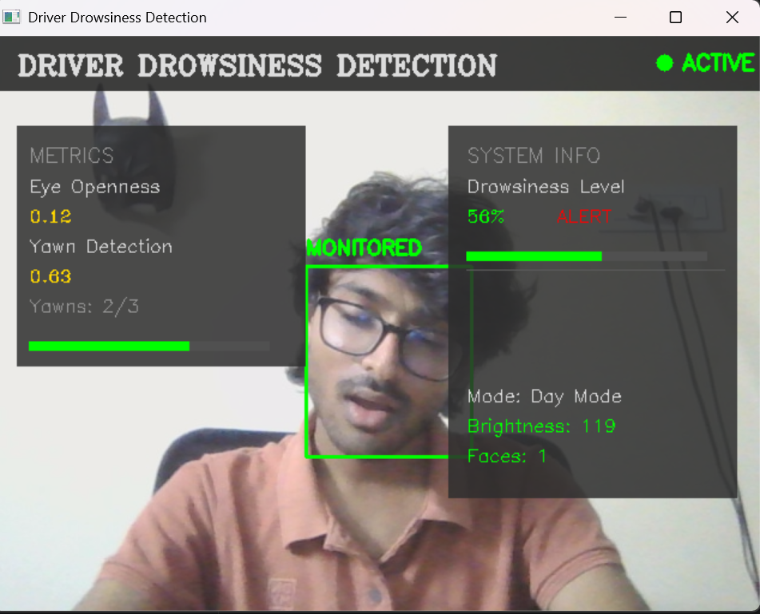
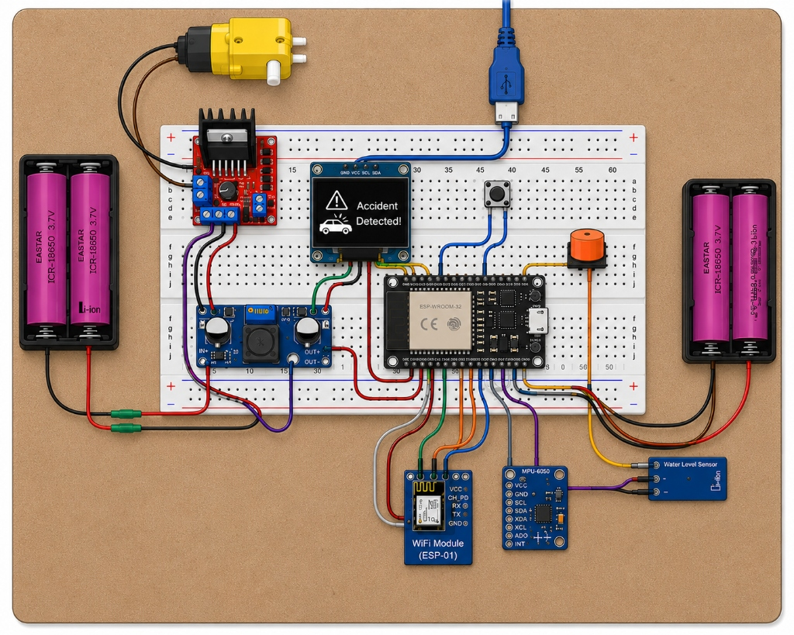

# IoT-Based Accident, Alcohol & Drowsiness Detection System 🚗⚠️

An advanced IoT and AI-powered driver safety monitoring system. This project integrates hardware sensors (ESP32, MPU6050, MQ-3, Neo-6M GPS) and computer vision (OpenCV, MediaPipe) to detect driver drowsiness, alcohol consumption, and vehicle accidents in real-time, providing immediate visual, auditory, and Telegram alerts.

## 🌟 Key Features
- **Real-Time Drowsiness Detection:** Uses OpenCV and MediaPipe to track Eye Aspect Ratio (EAR) and Mouth Aspect Ratio (MAR).
- **Alcohol Detection:** MQ-3 sensor continuously monitors cabin air for alcohol traces.
- **Accident Detection:** MPU6050 IMU detects sudden impacts or rollovers based on accelerometer and gyroscope data.
- **Live GPS Tracking:** Neo-6M GPS module plots the real-time location on a web-based map.
- **Emergency Alerts:** Automatically sends a Telegram alert with Google Maps location links when an emergency is detected.
- **Web Dashboard:** A responsive, sleek local dashboard showing live sensor metrics, gauge charts, and engine status.
- **Engine Control:** Automatically cuts off the engine (via relay/motor driver) upon detecting any critical alert.

## 📸 System Screenshots
*(Please add your images to the `images/` folder with these names, or update the paths below)*

### Web Dashboard



### Drowsiness Detection (Computer Vision)



### Hardware Setup


## 🛠️ Hardware Requirements
- **Microcontroller:** ESP32 (or ESP8266)
- **Sensors:** MPU6050 (IMU), MQ-3 (Alcohol Sensor), Neo-6M (GPS Module)
- **Actuators/Outputs:** Buzzer, Motor Driver (L298N) for Engine Simulation, OLED Display (SSD1306)
- **Camera:** Standard PC Webcam (for Python CV script)

## 💻 Software Requirements
- **Arduino IDE:** For uploading the ESP32 firmware.
  - Libraries: `Adafruit_GFX`, `Adafruit_SSD1306`, `I2Cdev`, `MPU6050`, `UniversalTelegramBot`, `TinyGPSPlus`, `ArduinoJson`
- **Python 3.x:** For the drowsiness detection script.
  - Packages: `opencv-python`, `mediapipe`, `pyserial`, `numpy`

## 🚀 Setup & Installation

### 1. Hardware (ESP32 Firmware)
1. Open `esp32_firmware/esp32_firmware.ino` in the Arduino IDE.
2. Update your Wi-Fi credentials:
   ```cpp
   const char* ssid     = "YOUR_WIFI_SSID";
   const char* password = "YOUR_WIFI_PASSWORD";
   ```
3. Update your Telegram Bot Token and Chat ID.
4. Upload the code to your ESP32.

### 2. Software (Drowsiness Detection)
1. Install Python dependencies:
   ```bash
   pip install opencv-python mediapipe pyserial numpy
   ```
2. Check your device's Device Manager for the COM port connected to the ESP32 (or Arduino/SIM900A) and update the `SERIAL_PORT` variable in the Python scripts.
3. Run the preferred script:
   ```bash
   python python_drowsiness/drowsiness_mediapipe.py
   ```

## 🛡️ License
This project is open-source and available under the MIT License.
